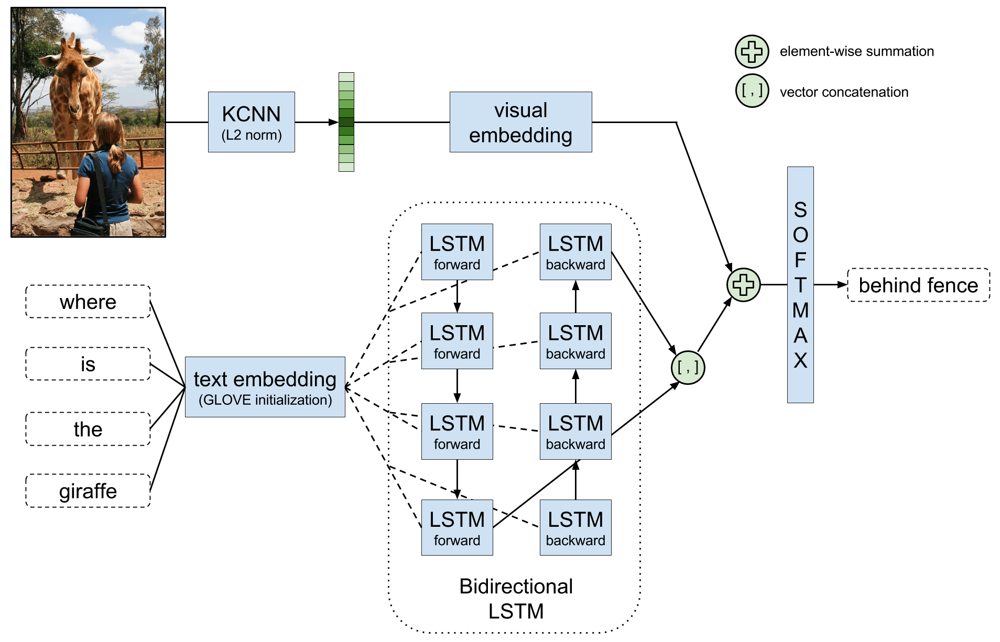
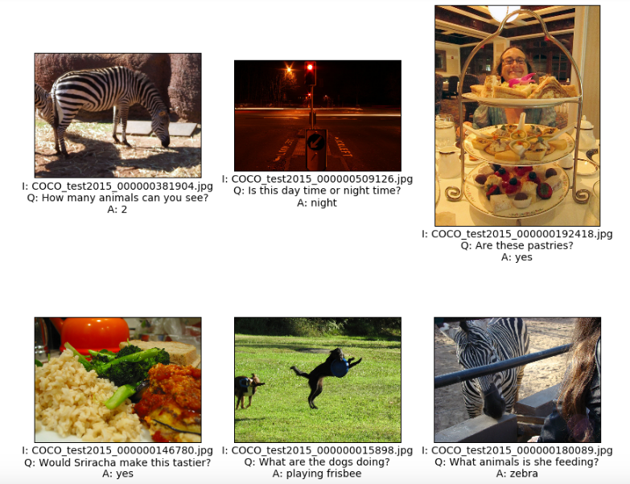

# VIBIKNet
This repository contains the code for the Visual Bidirectional Kernelized Network for Visual Question Answering,
presented at the [VQA Challenge](http://visualqa.org/challenge.html) at CVPR'16. 
With this module, you can replicate our experiments and easily deploy new models. VIBIKNet is built upon the 
[Keras](https://github.com/fchollet/keras) framework and tested for the [Theano](http://deeplearning.net/software/theano)
backend.


## Installation

VIBIKNet requires the following libraries:

 - [Our version of Keras](https://github.com/MarcBS/keras) v1.0.4 or newer
 - [Multimodal Keras Wrapper](https://github.com/MarcBS/staged_keras_wrapper) v0.1 or newer
 - [VQA challenge evaluation scripts](https://github.com/lvapeab/coco-caption/tree/master/pycocoevalcap/vqa)

Additionally, if you want to run the tutorials and the visualization module, you'll need:

  - [Jupyter Notebook](http://jupyter.readthedocs.io)
  - [Matplotlib](http://matplotlib.org)
 
If you want to extract KCNN features you will need (see the following [README](./features_extraction/KCNN/README.md) for more info):

 - [Matlab](http://es.mathworks.com/products/matlab/) 2014a or newer or [Octave](https://www.gnu.org/software/octave/download.html)
 - [Caffe](https://github.com/BVLC/caffe). Download into ~/code/caffe folder or change path in extractCNNfeatures.m
 - [EdgeBoxes](https://github.com/pdollar/edges) object detection. Download into /repository_root/edges folder.
 - [Piotr Dollar toolbox](https://github.com/pdollar/toolbox). Download into /repository_root/piotr_toolbox folder.
 - [Inria's Yael library](https://gforge.inria.fr/projects/yael/) for Matlab. Download into /repository_root/yael folder and compile for you system. See yael's release notes for more information.

If you want to use pretrained word embeddings, you can either train them by yourself using
 [Glove](http://nlp.stanford.edu/projects/glove/) or [Word2Vec](https://code.google.com/archive/p/word2vec/), 
 or download pretrained word embeddings (recommended):

 - [Pretrained Glove vectors](http://nlp.stanford.edu/data/glove.42B.300d.zip)
 - [Pretrained Word2Vec vectors](https://drive.google.com/file/d/0B7XkCwpI5KDYNlNUTTlSS21pQmM/edit?usp=sharing)


## How to use
 
 - For extracting KCNN features, see the following [README](./features_extraction/KCNN/README.md).
 - For training a new model, follow the [train README](./VIBIKNet/README.md).
 - For visualizing the results, follow the [visualize_results](./VIBIKNet/visualize_results.ipynb) notebook.


## VIBIKNet model at the CVPR VQA Challenge

See CVPR poster [here](https://www.researchgate.net/publication/304623360_VIBIKNet_Visual_Bidirectional_Kernelized_Network_for_Visual_Question_Answering).
 


## Examples

These answers have been automatically generated by VIBIKNet:




## Project citation

If you use this project, please, cite the following publication:

```
Bolaños, M., Peris, Á., Casacuberta, F., & Radeva, P. 
VIBIKNet: Visual Bidirectional Kernelized Network for Visual Question Answering
Iberian Conference on Pattern Recognition and Image Analysis, IbPRIA '17 (In press).
```

## References

```
Liu Z. 
Kernelized Deep Convolutional Neural Network for Describing Complex Images. 
arXiv preprint arXiv:1509.04581. 2015 Sep 15.
```

```
Peris Á, Bolaños M, Radeva P, Casacuberta F. 
Video Description using Bidirectional Recurrent Neural Networks. 
arXiv preprint arXiv:1604.03390. 2016 Apr 12.
```

```
Malinowski M, Rohrbach M, Fritz M. 
Ask your neurons: A neural-based approach to answering questions about images. 
In Proceedings of the IEEE International Conference on Computer Vision 2015 (pp. 1-9).
```

## About

Joint collaboration between the [Computer Vision at the University of Barcelona (CVUB)](http://www.ub.edu/cvub/) group at [Universitat de Barcelona](www.ub.edu)-[CVC](http://www.cvc.uab.es) and the [PRHLT Research Center](https://www.prhlt.upv.es) at [Universitat Politècnica de València](https://www.upv.es).


## Contact

Marc Bolaños ([web page](http://www.ub.edu/cvub/marcbolanos/)): marc.bolanos@ub.edu

Álvaro Peris: lvapeab@prhlt.upv.es 
 
 
