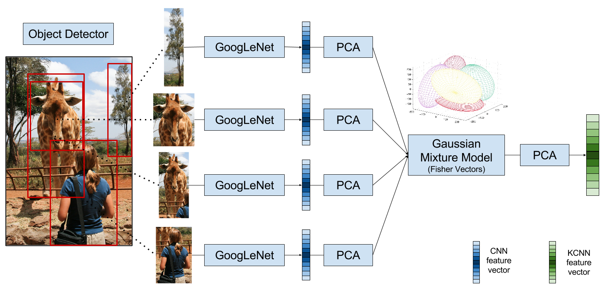

## Steps to follow when executing the KCNN functions

  - 1) extractObjectProposals.m
  
  Extracts object candidates using EdgeBoxes for all the images in the dataset.

  - 2) extractCNNfeatures.m
  
  Extracts ImageNet and Places features for all the images in the datasets. 
The features are extracted on each of the object proposals and their rotations.
In all the following functions ImageNet and Places features will always be
treated separately.

  - 3) applyNormPCA.m	**training only**
  
  Normalizes the features and applies Principal Components Analysis on the training 
samples and stores the parameters.

  - 4) applyNormPCA_test.m
  
  Applies the parameters extracted in applyNormPCA.m to all the samples in the dataset.

  - 5) learnGMM.m	**training only**
  
  A Gaussian Mixture Model is learned using the PCA features of the training samples
and stores the corresponding parameters.

  - 6) transformFVs.m
  
  Calculates the fisher vectors for each image in the dataset using the parameters learned
in learnGMM.m

  - 7) applyNormPCAFV.m	**training only**
  
  Again, normalizes the features and applies PCA on the training samples after the FVs 
calculation.

  - 8) applyNormPCAFV_split.m
  
  Uses the parameters learned in the previous function for reducing the dimensionality 
of the FVs for all the samples. Stores the samples in separate data splits 
{train,val,test}.


## General KCNN extraction scheme




## Citations

```
@article{liu2015kernelized,
  title={Kernelized Deep Convolutional Neural Network for Describing Complex Images},
  author={Liu, Zhen},
  journal={arXiv preprint arXiv:1509.04581},
  year={2015}
}
```

```
@inproceedings{zitnick2014edge,
  title={Edge boxes: Locating object proposals from edges},
  author={Zitnick, C Lawrence and Doll{\'a}r, Piotr},
  booktitle={European Conference on Computer Vision},
  pages={391--405},
  year={2014},
  organization={Springer}
}
```
